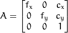

## Advanced Lane Finding
[](http://www.udacity.com/drive)
  
This project uses computer vision to a build software pipeline to identify the lane boundaries in a video.


## Overview 
The goals / steps of this project are the following:

* Compute the camera calibration matrix and distortion coefficients given a set of chessboard images.
* Apply a distortion correction to raw images.
* Use color transforms, gradients, etc., to create a thresholded binary image.
* Apply a perspective transform to rectify binary image ("birds-eye view").
* Detect lane pixels and fit to find the lane boundary.
* Determine the curvature of the lane and vehicle position with respect to center.
* Warp the detected lane boundaries back onto the original image.
* Output visual display of the lane boundaries and numerical estimation of lane curvature and vehicle position.
  
Here I will consider the [rubric points](https://review.udacity.com/#!/rubrics/571/view) individually 
and describe how I addressed each point in my implementation.  

### Camera Calibration
The first part the pipeline is to correct the distortion of the image. The two type of distortion here are:

|  Radial Distortion   |   Tangential Distortion  | 
|:-------------:|:-------------:| 
| This happens since real cameras use curved lenses to form an image, and light rays often bend a little too much or too little at the edges of these lenses.      | This occurs when a camera’s lens is not aligned perfectly parallel to the imaging plane, where the camera film or sensor is.        |
|  | |
| 3 parameters k1, k2, k3 to describe disortion      | 2 parameters p1, p2 to describe distortion       |
|      |        |

The idea of camera calibration is that these 5 parameters are the property of the camera so we can use it to take 
some test images that we know the correct coordinates and solve the equation. And these parameters once computed can be
used to distort all the images taken by this camera.
  
  
Another thing to compute is the intrinsic camera matrix(3x3) contains focal length(fx, fy), shift of camera center(Cx, Cy). It's responsible for translate camera based 3-D coordinate into image 2-D coordinate. 

  
For each test image, an extrinsic camera matrix(3x4) is also computed which translate a 3-D coordinate in arbitary system into 
camera based 3-D coordinate system. Together with intrincic camera_matrix, it tranlsates 3-D points into 2-D image points.

Given enough pairs of ((X, Y, Z), (X_corrected, Y_corrected)), we can solve the equations and get 
the parameters including intrinsic camera matrix and distortion coefficients. `opencv` provides two helpful functions: 
* `cv2.calibrateCamera` to compute the intrinsic camera matrix and distortion coefficients
* `cv2.undistort` to undistort an image using the computed params

Run the [camera_undistort.py](camera_undistort.py), it will compute, cach the params and undistort the given image:
```bash
> python camera_undistort.py -h
usage: Display undistorted calibration image. [-h] [-f F]

optional arguments:
  -h, --help  show this help message and exit
  -f F        path to test image
> python camera_undistort.py -f camera_cal/calibration1.jpg
```


### Threshold
The second part of the pipeline is to find possible pixels of lane lines. Threshold with different filters are combined 
here. My strategy here is to have a couple of slightly strict thresold and combine theme use logical OR:
* gradient on x-axis with sobel filter size of 5
* gradient on y-axis with sobel filter size of 5
* s channel with a mask to suppress shadow with high s value
* hsv combined for shadowed yellow
* rgb combined for white

Run the [threshold.py](threshold.py), it will apply the combined filters to given image:
```bash
> python threshold.py -h
usage: Display thresh-filtered image. [-h] [-f F]

optional arguments:
  -h, --help  show this help message and exit
  -f F        path to test image
> python threshold.py -f test_images/test2.img
```


### Perspective transform
The lane lines are parallel in 3-D world. But when projected on a 2-D image plane with current camera position,
they aren't parallel any more and will intersect at the vanishing point. By perpective transform to a bird-eye view,
we can maintain that property and make it easier to compute cuvature later. `opencv` also has helpful functions for 
these tasks:
* `cv2.getPerspectiveTransform` compute the convert matrix given source and destination 
* `cv2.warpPerspective` uses convert matrix to convert an image

The source & desination pair I choose here is:  

| Source        | Destination   | 
|:-------------:|:-------------:| 
| 589, 460      | 320, 0        | 
| 203, 720      | 320, 720      |
| 1127, 720     | 960, 720      |
| 705, 460      | 960, 0        |
  
Run the [perspective_transform.py](perspective_transform.py), it will apply transform to given image:
```bash
> python perspective_transform.py -h
usage: Display bird eye transformed image. [-h] [-f F]

optional arguments:
  -h, --help  show this help message and exit
  -f F        path to test image
> python perspective_transform.py -f test_images/test2.jpg
```


### Find land line
The fourth part of pipeline is to find lane line pixels and fit it with a 2nd order polynomial.
Two ways I used to search lane line pixels here:  
  
| Sliding Window    | Previous fit | 
|:-------------:|:-------------:| 
|       |         | 
| This method split image into multiple layers, locate window at the most intense area and mark those inside windows as lane line points      | This method search within a range from previous found lane lines.      |

After getting the left & right lane line points, I will overlap the two set of points by: 
* shift one set of points along x-axis within a range 
* find top 5 shift distance that has most common points
* average them and get the final shift distance
* shift left points to right, shift right points to left
  
Two reasons for this overlap:
* It's targeting the problem of dashed lines since missing a big part at very top/bottom can cause inaccuracy in polynomial fit.
* The lane lines are parallel so this method should make both more robust, since it gives a chance for the other line to fill the missing part.  


The lan
  
### Compute the curvature and vehicle position
The curvature of a 2nd order polynomial could be computeds by:  

  
Lane line mid point is computed by averaging bottom point of two ploynormial,
the car position is assumed to be in the mid of the image. By scaling between
pixel and meter, the final result of curvature and relative vehicle position are
drawn to the top left corner of the image.


### Image Pipeline
Put all the parts together:
```python
from camera_undistort import undistort_image
from threshold import combined_threshold
from perspective_transform import original2bird_eye, invert_matrix
from find_lane_line import calc_lane_lines, xm_per_pix


def process_image(image):
    undistorted = undistort_image(image)
    threshold = combined_threshold(undistorted)
    bird_eye = original2bird_eye(threshold)
    lane_line_params = calc_lane_lines(bird_eye)
    result = draw_lane_lines(undistorted, lane_line_params)
    
    return result
```
Run the [image_pipeline.py](image_pipeline.py), it will process the given image and plot result of each step:
```
> python image_pipline.py -h
usage: Display processed image. [-h] [-f F]

optional arguments:
  -h, --help  show this help message and exit
  -f F        name of test image
> python image_pipline.py -f test_images/test2.jpg
```


### Video Pipeline
This one is based on image_pipeline with two more things:
* smooth of the curvature by averaing the lastest 7 frames
* compute the confidence of the found lane lines and choose what search strategy to use in next frame

Since I overlap the two lane line points, the ploynomial is parallel with same curvature. I compute the confidence
by using the latest two frames `confident = abs(curve - last_curve) / curve < 0.2`. This method works well to detect
failure with curved lines which has relatively small curvatures. But tends to use sliding window for straight lines 
since the curvature of straight lines vary a lot which I think is ok since straight lines are easy to find by sliding window.
  


### Discussion
The most thing I want to improve later is the threshold, now it's not robust enough to shadow and different light conditions and
it's the foudation of later analysis. 
